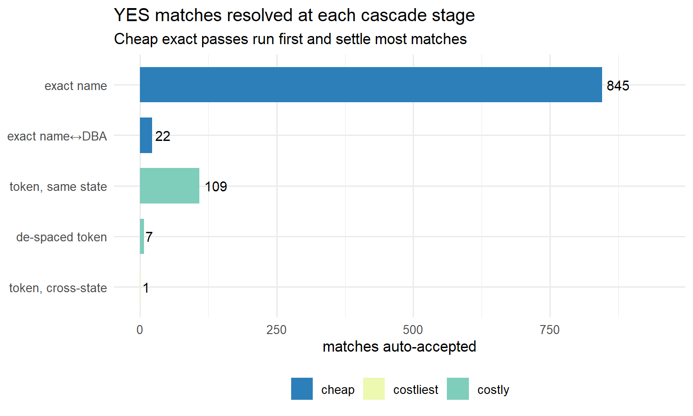
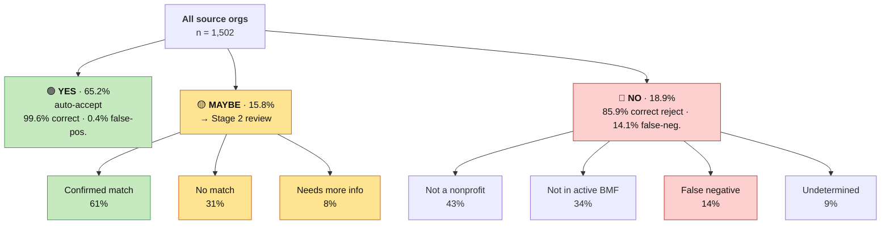

# npmatch: A Reviewer’s Guide

*A plain-language overview of how the nonprofit crosswalk is built, what
the package decides on its own, and where a human — or an LLM standing
in for one — comes in.*

## 1. What the package does

**npmatch** links organizations from one list (here, federal award and
registration records keyed by a **UEI**) to the IRS **Business Master
File** of nonprofits (keyed by an **EIN**). It does three things:

1.  **Normalizes** both sides so they can be compared fairly.
2.  **Runs a multi-tier matching strategy** — strict first, then
    progressively looser — scoring how well each candidate agrees on
    name and address.
3.  **Returns a scored, labeled candidate dataset** — for every source
    organization: the candidate EIN(s) it weighed, a 0–1 match score,
    and a **decision label: YES, MAYBE, or NO**.

The output is not just “the answer.” It is an auditable table showing
*which candidates were considered and why one was chosen* — the raw
material for the review stage.

## 2. How names and addresses are normalized

Before anything can be compared, “The Smith Family Foundation, Inc.” and
“Smith Family Fdn” have to be made to look alike. npmatch cleans each
name to a **match key**, then splits it into **tokens** (the words the
matcher actually compares). Legal suffixes (Inc, Foundation), a leading
“The”, and punctuation are dropped; abbreviations are standardized (St →
Saint, & → and, Ctr → Center).

Punctuation *inside* a word is deleted rather than turned into a space,
which is why “Y.W.C.A.” collapses to the single token `YWCA` and
“Mary’s” to `MARYS`. This matches how the IRS file itself stores names —
it holds `ST LUKES`, not `ST LUKE S` — so a possessive or an initialism
can still clear an exact-name match. A period that already separates
words (“St. Mary’s”) keeps its break.

| Original name | Cleaned match key | Tokens compared |
|:---|:---|:---|
| The Smith Family Foundation, Inc. | SMITH FAMILY | SMITH · FAMILY |
| St. Mary’s Hosp. & Health Ctr | SAINT MARYS HOSP AND HEALTH CENTER | SAINT · MARYS · HOSP · AND · HEALTH · CENTER |
| Boys & Girls Club of N.E. Texas | BOYS AND GIRLS CLUB OF NE TEXAS | BOYS · AND · GIRLS · CLUB · OF · NE · TEXAS |
| Y.W.C.A. of Helena | YWCA OF HELENA | YWCA · OF · HELENA |
| StepForward | STEPFORWARD | STEPFORWARD |

Addresses are parsed the same way — a standardized street body, a
separated **unit**, and a **ZIP hierarchy** (the 5-digit ZIP nests
inside a 3-digit region, so a match can degrade gracefully when only
partial geography is known).

| Original address                 | Street key    | Unit      | ZIP5  | ZIP region |
|:---------------------------------|:--------------|:----------|:------|:-----------|
| 123 North Main Street, Suite 400 | 123 N MAIN ST | SUITE 400 | 63101 | 631        |
| P.O. Box 1234                    | PO BOX 1234   | —         | 45201 | 452        |
| 45 Elm St Apt 2B                 | 45 ELM ST     | APT 2B    | 20814 | 208        |

**Corrupted records are *tolerated*, not silently fixed.** Rather than
guess a correction, the matcher compares the fuzzy *similarity* of the
two strings, so a typo or a spacing slip in the official record still
scores as a near-match. A few real BMF cases the fuzzy layer recovers:

| Source name | BMF record (as filed) | Name similarity |
|:---|:---|---:|
| CENTER FOR TRANSPORTATION AND THE ENVIRONMENT | …AND THE ENVIROMENT (missing N) | 0.99 |
| STEP FORWARD | STEPFORWARD (de-spaced) | 0.98 |
| HILLEL FOUNDATION | HILEL FOUNDATION (dropped L) | 0.91 |

## 3. The two-stage idea

npmatch is deliberately split into two stages:

> **Stage 1 (the algorithm)** surfaces and sorts the candidates — fast,
> consistent, cheap across millions of records. **Stage 2 (a human or an
> LLM)** confirms the ambiguous cases and gathers the extra evidence the
> algorithm can’t see.

The three labels are the handoff. **YES** is confident enough to accept
automatically; **NO** is confident enough to reject; **MAYBE** means *“a
match probably exists, but I can’t be sure on name and address alone —
please look.”* Stage 1’s job is not to be right about everything — it is
to be **right when it is confident and honest when it isn’t**, so Stage
2’s effort goes only where it is needed.

## 4. The matching cascade (fastest checks first)

The multi-tier strategy runs cheapest-to-most-expensive and stops
working on a source org once it is confidently placed. Exact
name-and-place agreement is a fast hash lookup; the broad token search
(comparing every shared distinctive word) is far costlier, so it only
runs on what is still unresolved. On the 1,502 benchmark cases, **the
four exact passes settle ~88% of all YES matches before the expensive
token search runs at all.**



## 5. Reading the output: candidate sets

For each source organization, npmatch surfaces the candidate EINs it
considered with everything needed to judge the fit — the candidate’s
name, a **Name Similarity** (0–1), which **Name Version** matched, the
combined **Full Match Score**, and any veto that fired. Three real
examples show the flavor and the pathologies. *(The source organization
is named above each candidate set so you can see what it is being
matched against.)*

**(a) A clear winner amid noise.** The blocking step casts a wide net,
so weak look-alikes appear — but the true match dominates and is
auto-accepted (YES).

> **Source organization:** *The North Carolina Coalition Against
> Domestic Violence, Inc.*

| Candidate | Name Similarity | Name Version | Full Match Score | Why |
|:---|---:|:---|---:|:---|
| The North Carolina Coalition Against Domestic Violence | 0.95 | name | 0.95 | near-exact name + state → the pick |
| North Carolina (DBA fragment) | 0.86 | dba | 0.59 | shares only the state words → noise |
| NC Guardian ad Litem Assn | 0.67 | token overlap | 0.48 | a few shared words, different org → noise |

**(b) An organization vs. its foundation (a family of related EINs).**
When both the operating org and its affiliated foundation sit at the
same place, the foundation is *soft-vetoed* — surfaced, but held back
from auto-accept so a reviewer confirms which EIN is meant.

> **Source organization:** *New York Rural Water Association*

| Candidate | Name Similarity | Name Version | Full Match Score | Veto | Why |
|:---|---:|:---|:---|:---|:---|
| New York Rural Water Association | 1 | exact | 0.96 | — | the operating org → auto-accept |
| New York Rural Water Foundation | 1 | exact | → MAYBE | affiliate_suffix (Foundation) | the affiliate arm → routed to review, not auto-accepted |

**(c) A genuinely ambiguous cluster → MAYBE.** Several neighborhood
organizations share the distinctive words; none clearly *is* the source
org, so the algorithm refuses to guess and sends the set to review.

> **Source organization:** *Young Men’s and Young Women’s Hebrew
> Association of Washington Heights*

| Candidate | Name Similarity | Name Version | Full Match Score | Why |
|:---|---:|:---|---:|:---|
| Washington Heights Inwood Mask Blocc… | 0.79 | token overlap | 0.78 | top candidate, but not decisive |
| Washington Heights & Inwood Devel… | 0.85 | token overlap | 0.73 | close second |
| Chamber of Commerce of Washington Hts | 0.79 | token overlap | 0.69 | related, weaker |
| Washington Heights Inwood Preserv… | 0.75 | token overlap | 0.67 | related, weaker |

The recurring pathologies: **shared generic/geographic words** (a),
**parent/subsidiary/affiliate families** (b), and **dense clusters of
similarly-named local orgs** (c). Name and address alone can rank these
but cannot always decide them — which is the entire reason for MAYBE.

## 6. How well it recovers EINs

The goal is to recover as many **correct EINs** as possible, so the
useful way to score the package is as a *linkage* task — the positive
result is “a correct EIN was assigned” — not a “nonprofit vs. not”
classification. That reframing keeps one awkward case honest: assigning
the *wrong* EIN is neither a success nor a misclassification of the
organization; it is simply a **linkage error** (it costs both precision
and recovery).

The 1,502 hand-verified cases divide by ground truth as follows — and
flow through the tiers as the diagram shows, the review stage recovering
most of what lands in MAYBE:

| Ground-truth category                              | Count | Share |
|:---------------------------------------------------|------:|:------|
| Linkable nonprofit — a findable IRS record exists  |  1187 | 79%   |
| Nonprofit, but not in the active IRS file          |   113 | 8%    |
| Not a nonprofit (government / for-profit / person) |   136 | 9%    |
| No match, not otherwise classifiable               |    22 | 1%    |
| Undetermined                                       |    44 | 3%    |



Figure 1

> **How to read these numbers**
>
> - **Recall (sensitivity, “recovery”)** — of the nonprofits that *have*
>   a findable EIN, the share we linked to the *correct* one. This is
>   the headline for “recover as many EINs as possible.”
> - **Precision** — when the package hands back an EIN, how often it is
>   the right one. A *wrong* EIN counts against precision (and against
>   recall — we missed the true one); it is never scored as a success.
> - **Specificity** — of the orgs that should *not* be linked (not a
>   nonprofit, or absent from the file), how often we correctly withhold
>   a match.

| Metric | Value | What it means |
|:---|:---|:---|
| Recall / recovery — automatic | 84% | of nonprofits with a findable EIN, the share auto-linked to the correct EIN |
| Recall / recovery — auto + review | 96.5% | …after a human or LLM works the MAYBE queue |
| Precision of assigned links | ~99% | when an EIN is assigned, the share that are the right EIN (6 wrong of 980) |
| Specificity | 99.0% | of not-a-nonprofit / not-in-file orgs, the share correctly left unlinked (3 spurious of 297) |

**Two recovery denominators** answer different questions — report both:

| Recall denominator | Value | Out of | Note |
|:---|:---|:---|:---|
| Achievable — matcher performance | 96.5% | nonprofits with a findable IRS record (1,187) | measures the algorithm itself |
| Population yield — practical | ~85% | all nonprofits, incl. those absent from the file (1,300) | ~1 in 11 nonprofits has no active IRS record; the inactive-file option recovers ~6% |

> Of the nonprofits in the source data that have a matchable IRS record,
> the package recovers the correct EIN for **96.5%** (84% fully
> automatic, the rest confirmed in review), and when it assigns an EIN
> it is right **~99%** of the time. It correctly declines to link
> **99%** of the organizations that are not nonprofits or are absent
> from the file. The main ceiling on total recovery is IRS coverage
> itself — about **1 in 11** nonprofits has no active record — which the
> inactive-file option partially recovers.

Operationally, every source org lands in one of three tiers. Here is
what each means and where its errors come from.

### **YES — “accept this match”** · ~99% correct (a wrong EIN ~1% of the time)

Strong name and address agreement, no veto. Reviewer effort is light:
confirm the obvious pick. *Why the ~1% go wrong:* two different
organizations sharing distinctive words **and** an address —

- **Same campus, different entity** — a booster club, auxiliary, or
  foundation at its parent’s building (“Virtua Health” vs “Virtua Health
  and Rehabilitation”).
- **Same distinctive name, wrong entity type** — “Luzerne County Housing
  Authority” pulled toward “Luzerne County Historical Society.” *(A new
  government-entity rule now routes most of these to MAYBE.)*

### **MAYBE — “a match likely exists; please review”** · the review tier

Of everything sent to MAYBE, **61% turn out to be a real match**, 31%
resolve to no-match, and 8% need more information. Combined with YES,
**~98% of all true matches are surfaced** for a reviewer to see. *Why a
case lands here, not in YES:*

- **Subset / superset names** — “Nowlin Hall” vs “Nowlin Hall
  Apartments”: same org or a related property? Name alone can’t tell.
- **Parent vs subsidiary vs chapter** — all share the distinctive words,
  so the algorithm surfaces them but refuses to guess which EIN.
- **Cross-state parents** — a national org filing under a headquarters
  in a different state than the local address.

### **NO — “no acceptable match found”** · mostly correct; ~2% of true matches missed

Most NO answers are right. Among the correct rejections, **~50%** are
genuinely not nonprofits (government, for-profit, individuals), **~39%**
are real nonprofits absent from the *active* file (foreign, brand-new,
co-ops, churches), and ~10% are undetermined. The small share of **false
negatives** happen two ways:

1.  **The right candidate was never surfaced (a “blocking” miss)** — the
    names are too different for the search to connect:
    - **Rebrands** — “Coalition for the Common Good” is Antioch
      University’s new legal name; the strings share nothing.
    - **Acronyms** — “YWCA of Helena” vs “Young Women’s Christian
      Association.”
    - **Typos in the record** — “…Environment” vs the BMF’s
      “…Enviroment.”
    - **Spacing / abbreviation** — “Step Forward” vs “StepForward.”
      *(Now recovered automatically.)*
2.  **The org truly isn’t in the file** — churches (auto-exempt, often
    unlisted), foreign orgs, brand-new nonprofits. Here NO is *correct*;
    the reviewer just confirms it.

## 7. What a reviewer does in each tier

| Tier | Effort | Task |
|:---|:---|:---|
| 🟢 YES | Light / spot-check | Confirm the auto-selected EIN against the surfaced candidates. |
| 🟡 MAYBE | Moderate | Pick the right candidate, or gather a little evidence to decide. |
| 🔴 NO | Targeted | Confirm the org is genuinely unmatched — or research a possible miss. |

Because YES is ~98% precise and NO is mostly correct, **the real work
concentrates in MAYBE** — exactly where you want human judgment spent.

## 8. The review report

The MAYBE queue is where a reviewer’s attention goes, and
[`np_review_report()`](https://nonprofit-open-data-collective.github.io/npmatch/reference/np_review_report.md)
turns it into a self-contained HTML page built for exactly that. Each
source organization gets its own section, and every candidate is laid
out as a **side-by-side “matching form”**: the two names, nonprofit
type, age, size, affiliation, address, and point of contact aligned
row-for-row — source on the left, IRS BMF / SAM on the right — followed
by the match-score block (score, decision, name and address similarity,
the cascade layer that surfaced it, and any veto). The candidate the
pipeline selected floats to the top of its section, so the reviewer
starts from the algorithm’s best guess and confirms or overrides it.

It reads the `review` frame straight from
[`np_route()`](https://nonprofit-open-data-collective.github.io/npmatch/reference/np_route.md):

``` r
res     <- np_cascade(query, reference)
routing <- np_route(res, bmf = bmf_raw, sam = sam_raw)  # $review carries BMF_/SAM_ context

np_review_report(routing, output = "review.html")        # the MAYBE queue, by default
```

The page is read-only and needs no server — open the file locally or
share it. Handy arguments:

- **`decision`** — which tiers to include (`"MAYBE"` by default; also
  `"ALL"`, `"YES"`, `"NO"`, or comma-combinations like `"MAYBE,NO"`).
- **`max_ueis`** — cap the number of cases (a deterministic sample when
  it truncates), for a quick look before rendering the whole queue.
- **`output`** — where to write the HTML.

If the frame also carries a labelled ground truth — the benchmarking
columns `is_gt_ein`, `gt_confidence`, `gt_outcome_class` — the report
highlights the correct EIN, floats it first, and flags cases where it
was never surfaced, so the same tool doubles as an audit view for the
evaluation set. On an ordinary
[`np_route()`](https://nonprofit-open-data-collective.github.io/npmatch/reference/np_route.md)
frame those columns are simply absent and the report renders without
them. Rendering uses Quarto (the `quarto` package plus a Quarto CLI
installation, the same dependency these vignettes use).

## 9. Humans or LLMs — interchangeable at Stage 2

Stage 2 is the same task whether a person or a language model does it:
*look at a surfaced organization, decide whether a candidate is the
right EIN, and if not, find out what the organization actually is.*
npmatch is built so the two are drop-in substitutes.

To make the LLM path turnkey, the project ships a **tiered research
protocol with a reusable per-organization prompt**
(`dev/RESEARCH-PROTOCOL.md`) that escalates only as far as needed and is
cost-aware:

- **Tier 1** — a free local recheck against the full IRS file (name
  variants, de-spaced forms, typos).
- **Tier 2** — nonprofit registries (e.g. ProPublica) for the EIN.
- **Tier 3** — open web search to establish what the org is when
  registries are silent.

Each organization returns a determination, the EIN found (if any), the
source, a confidence level, and a token/cost estimate — the same
structured verdict a human enumerator records, so the two mix freely
(LLM triage first, humans on the residual). This is what lets the review
stage scale from hundreds of cases to hundreds of thousands.

## 10. Where things stand today

- **Recovery (recall) ≈ 96.5%** of nonprofits with a findable EIN — 84%
  fully automatic, the rest confirmed in review.
- **Precision ≈ 99%** — when an EIN is assigned, it is almost always the
  right one.
- **Specificity ≈ 99%** — non-nonprofits and not-in-file organizations
  are correctly left unlinked.
- **MAYBE is ~16% of cases** — the focused Stage-2 queue, where most of
  the remaining recovery happens.
- The **unified** (active + inactive) IRS file raises the findable set —
  recovering ~6% more matches to historical / defunct EINs, each tagged
  `active` so downstream can separate current-990 matches from
  identity-resolution ones.

## Appendix — a peek at the evaluation dataset

Each row is one candidate the algorithm surfaced, with the fields a
reviewer uses to decide. (See the companion *Candidate Evaluation Frame*
vignette for full definitions.)

| source_org | best_candidate | name_sim | tier | gt_ein | note |
|:---|:---|---:|:---|:---|:---|
| Coalition for the Common Good | (Antioch University — rebrand, not surfaced) | NA | NO | 31-0536640 | rebrand: names share nothing (blocking miss) |
| YWCA of Helena | (Young Women’s Christian Assn — acronym) | NA | NO | 81-0235416 | acronym vs spelled-out (blocking miss) |
| Nowlin Hall Apartments | Nowlin Hall | 0.95 | MAYBE | 23-7110959 | subset name → review |
| Luzerne County Housing Authority | Luzerne County Historical Society | 0.90 | YES→(now MAYBE) | (no match) | govt entity, wrong type (veto now catches) |
| Freedom Bird Foundation | Operation Freedom Birds | 0.72 | MAYBE | 87-2482496 | short-form name → review |
